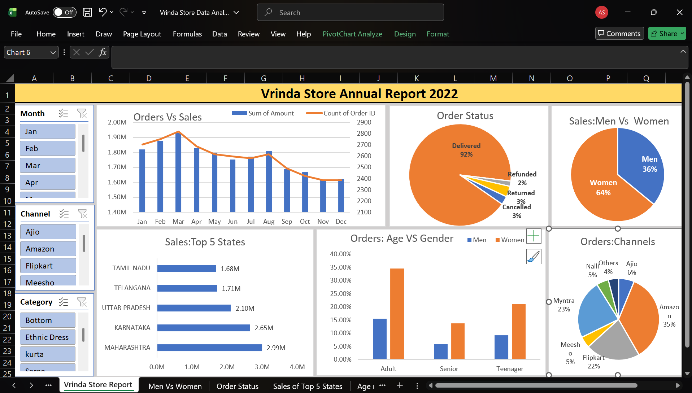

# Vrinda Store Annual Sales Analysis 

## 📊 Project Overview
This project involves a comprehensive end-to-end data analysis of **Vrinda Store**, an online retail business. The goal was to analyze sales data from 2022 to uncover customer trends, channel performance, and regional sales distribution to drive business growth in 2023.

## 🎯 Business Objectives
* Compare Sales and Orders using a single visualization.
* Identify the month with the highest sales and order volume.
* Determine which gender contributes more to total revenue.
* Identify the top 5 states contributing to the revenue.
* Identify the most profitable sales channels (Amazon, Flipkart, etc.).

## 🛠️ Tech Stack & Skills
* **Tool:** Microsoft Excel
* **Data Cleaning:** Removing duplicates, handling null values, and standardizing categorical data.
* **Data Processing:** Created Age Groups and extracted Months using Excel formulas.
* **Visualization:** Interactive Dashboards with Slicers and Pivot Charts.

## 📈 Key Insights
* **Top Customer Segment:** Women (Adult group) drive ~65% of total revenue.
* **Peak Season:** March recorded the highest sales volume.
* **Top Channels:** Amazon, Flipkart, and Myntra contribute nearly 80% of sales.

## 💡 Final Recommendation
To maximize sales, target Women aged 30-49 years in Maharashtra and Karnataka through Amazon/Flipkart marketing campaigns.

